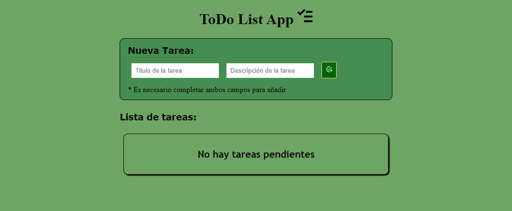
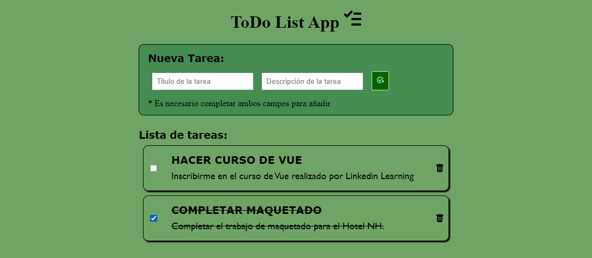

<h1>ToDo List App</h1>
 

Aplicación realizada en React, que da la posibilidad de agregar tareas, marcarlas como realizadas y eliminarlas. Realizada utilizando la librería React, separando en componentes que se muestran o no, dependiendo de la cantidad de elementos en el listado.

<h3>Algunas capturas de la aplicación:<h3/>

 
 
